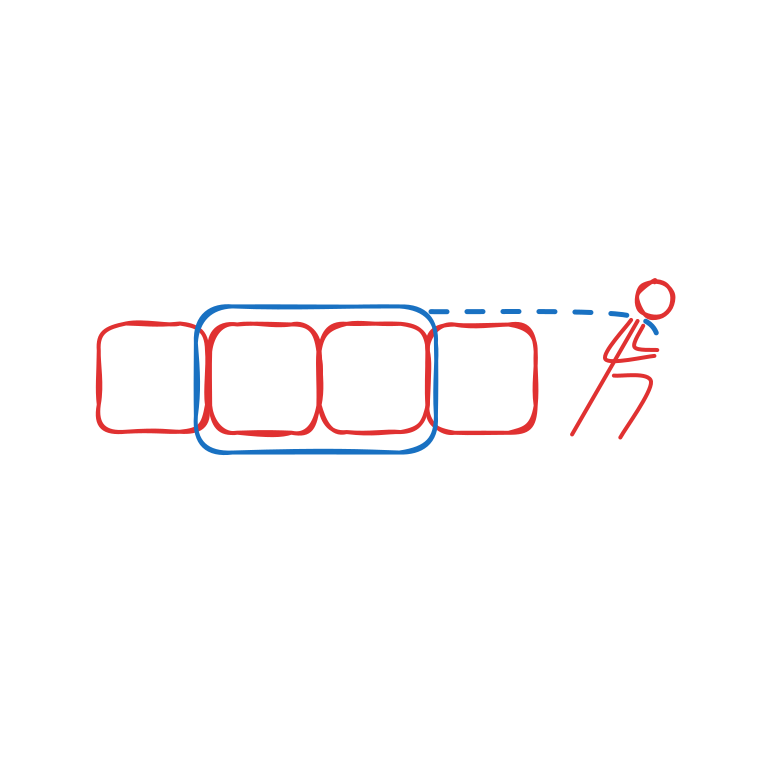

# Sliding Window



***

### How to Identify

#### To identify the problem:

* [ ] Question deals with array or string
* [ ] Question is related to a `continuous` sub-array or sub-string
* [ ] &#x20;Value of interest (sum, average, word count using hashmap) needs to be derivable from the window
* [ ] When window is moved by one step to the right there must be an overlap

***

### How to use Pattern

#### Initialisation

We will use pointer called start and end of the window.&#x20;



<pre class="language-python"><code class="lang-python">""" Initialise pointers 

<strong>1. k is the size of the window 
</strong><strong>2. Calculate the value of interest (sum, char-count etc.)
</strong>"""

start = 0
end = k - 1
window_value = sum(l[start:end+1])
</code></pre>




#### Moving the Window

Increment both pointers by one.


#### Utilising the overlap

To generate the new value once the window is moved, find the value that is no-longer a part of the window and remove from the previous generated value.

Then find the value that has entered the window on the right and include the value to genrate the new window value.


***

### Example

Given an integer array `nums`, find the subarray with the largest sum, and return _its sum_.

```
Input: nums = [1,5,4,2,9,9], k = 3
Output: 20
```



```python
from typing import List

def maxSumSubArray(nums: List[int], k: int) -> int:
    
    # Initialise value
    start = 0
    end = k
    length_of_nums = len(nums)
    window_sum = sum(nums[start:end+1])
    max_window_sum = 0
    
    # Move window by one step till it reaches end
    while end < length_of_nums - 1:
        end += 1
        new_window_sum = window_sum + nums[end] - nums[start]
        start += 1
        max_window_sum = max(max_window_sum, new_window_sum)
        
    return max_window_sum
        
```



***

### Practice Problems

<table><thead><tr><th>Leetcode Problem</th><th>Difficulty<select><option value="HclNJbV2t4NN" label="Easy" color="blue"></option><option value="6rIyenYckozY" label="Medium" color="blue"></option><option value="yPicniXyqa1c" label="Hard" color="blue"></option></select></th><th>Companies<select multiple><option value="fearNL3LIoNo" label="Google" color="blue"></option><option value="eeQJPAUb7mVq" label="Amazon" color="blue"></option><option value="2wwEiCcgDAWK" label="Apple" color="blue"></option><option value="c1NotTnbm6q0" label="Meta" color="blue"></option><option value="lRQ0XlGTMYzP" label="Adobe" color="blue"></option><option value="w2VI20xzESDF" label="Microsoft" color="blue"></option><option value="S1ZGGqu0cGQa" label="Linkedin" color="blue"></option></select></th></tr></thead><tbody><tr><td><a href="https://leetcode.com/problems/maximum-average-subarray-i/">Maximum Average Subarray I</a></td><td><span data-option="HclNJbV2t4NN">Easy</span></td><td><span data-option="fearNL3LIoNo">Google, </span><span data-option="eeQJPAUb7mVq">Amazon, </span><span data-option="2wwEiCcgDAWK">Apple, </span><span data-option="c1NotTnbm6q0">Meta, </span><span data-option="lRQ0XlGTMYzP">Adobe</span></td></tr><tr><td><a href="https://leetcode.com/problems/permutation-in-string/">Permutation in String</a></td><td><span data-option="6rIyenYckozY">Medium</span></td><td><span data-option="fearNL3LIoNo">Google, </span><span data-option="eeQJPAUb7mVq">Amazon, </span><span data-option="2wwEiCcgDAWK">Apple, </span><span data-option="lRQ0XlGTMYzP">Adobe</span></td></tr><tr><td><a href="https://leetcode.com/problems/maximum-number-of-vowels-in-a-substring-of-given-length/">Maximum Number of Vowels in a Substring of Given Length</a></td><td><span data-option="6rIyenYckozY">Medium</span></td><td><span data-option="fearNL3LIoNo">Google, </span><span data-option="2wwEiCcgDAWK">Apple</span></td></tr><tr><td><a href="https://leetcode.com/problems/sliding-window-maximum/">Sliding Window Maximum</a></td><td><span data-option="yPicniXyqa1c">Hard</span></td><td><span data-option="fearNL3LIoNo">Google, </span><span data-option="eeQJPAUb7mVq">Amazon, </span><span data-option="2wwEiCcgDAWK">Apple, </span><span data-option="c1NotTnbm6q0">Meta, </span><span data-option="lRQ0XlGTMYzP">Adobe, </span><span data-option="w2VI20xzESDF">Microsoft</span></td></tr></tbody></table>

